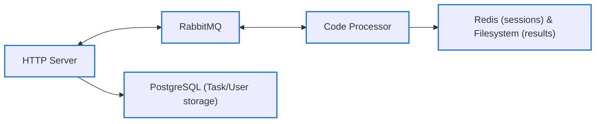
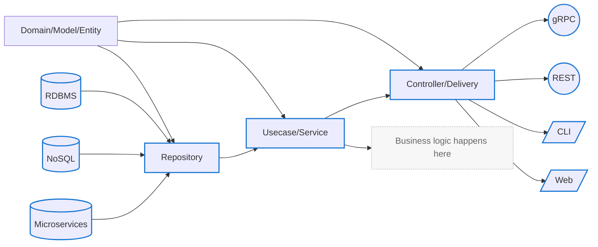
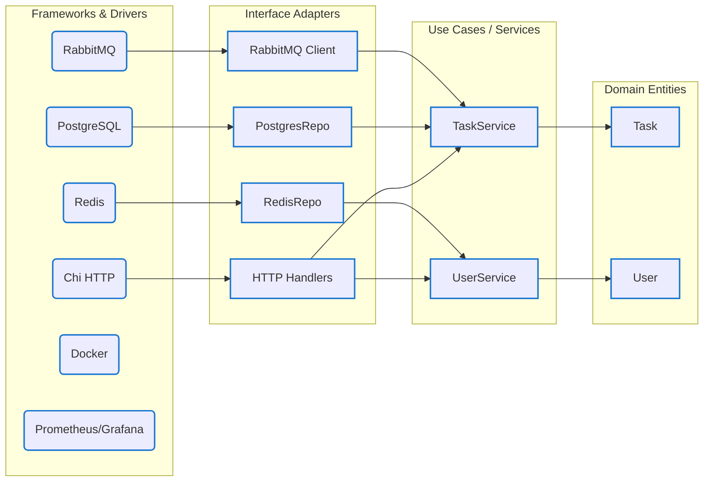

# Code-processor - раннер кода на Go

---
## Содержание

- [Технологии](#технологии) 
- [Архитектура](#архитектура)  
- [Основные компоненты](#основные-компоненты)  
- [Процессоры сообщений](#процессоры-сообщений)  
- [Инфраструктура](#инфраструктура)  
- [Мониторинг](#мониторинг)  

## Технологии

## Архитектура

### Общая архитектура микросервисов

## Clean Architecture (обобщённая схема)

Здесь отражён стандартный поток данных: от источников хранения через репозиторий, сервисы и контроллеры к внешним интерфейсам.

## Слои Clean Architecture в моём Go-проекте

- **HTTP Server** (Go, Chi) — REST API, сессии, Swagger-документация.
- **RabbitMQ** — брокер сообщений.
- **Processor** — отдельный сервис для выполнения кода (CodeProcessor) или фильтрации изображений (ImageProcessor).
- **PostgreSQL** — хранение пользователей и задач.
- **Redis** — хранение сессий.
- **Prometheus + Grafana** — сбор и визуализация метрик.
## Процессоры сообщений

### CodeProcessor

- На Go + Docker SDK
- Для каждой новой задачи создаёт Docker-контейнер с компиляторами (clang, gcc, python)
- Компилирует/запускает код внутри контейнера
- Возвращает `stdout`/`stderr`
# Основные компоненты

### 1. HTTP-сервер (`cmd/app`)
- **Авторизация** – `AuthMiddleware` проверяет JWT-сессии в Redis.
- **API по задачам** – CRUD-эндпоинты `/task`, `/status/{id}`, `/result/{id}`.
- **API по пользователям** – регистрация `/register`, логин `/login`.
- **Документация** – Swagger UI доступен по `/swagger/*`.
### 2. Сервис работы с задачами
- **TaskService** создаёт задачу, отправляет сообщение в RabbitMQ и хранит метаданные.
- **SessionService** управляет сессиями через Redis.
### 3. Репозитории
- **RamStorage** для быстрого прототипирования (в памяти).
- **PostgreSQL** для хранения Users и Tasks (миграции через `migrate`).
- **Redis** для сессий.
- **RabbitMQSender** для публикации сообщений в очередь `tasks`.
### 4. Processor-микросервисы (`processor/`)
- **CodeProcessor**:  
  - Получает JSON `{ "code": "...", "lang": "c" }` из очереди.  
  - В Docker-контейнере собирает и запускает чужой код (clang, gcc, python).  
  - Возвращает `stdout`/`stderr` через HTTP `/commit`.

---

# Инфраструктура

- **Docker & docker-compose**  
  - Сервисы: `http-server`, `rabbitmq`, `processor`, `postgres`, `redis`.  
  - Общая сеть, тома для БД и Redis.

- **Makefile**  
  - `make build` – сборка всех бинарников и Docker-образов.  
  - `make up` – поднять `docker-compose`.  
  - `make test` – запуск unit & integration тестов.

- **CI/CD (GitHub Actions)**  
  - Проверка `go fmt`/`go vet`, сборка, тесты.  
  - Линтинг Dockerfile, автоматический запуск `docker-compose` и smoke-тесты.  
  - Отдельная ветка `ci` с зелёными галочками.

---

# Мониторинг

- **Prometheus**  
  - Собирает метрики об обработке запросов и времени выполнения Processor’ов.  
- **Grafana**  
  - Дашборд с графиками latency, throughput и используемых фильтров/компиляторов.

---

  

